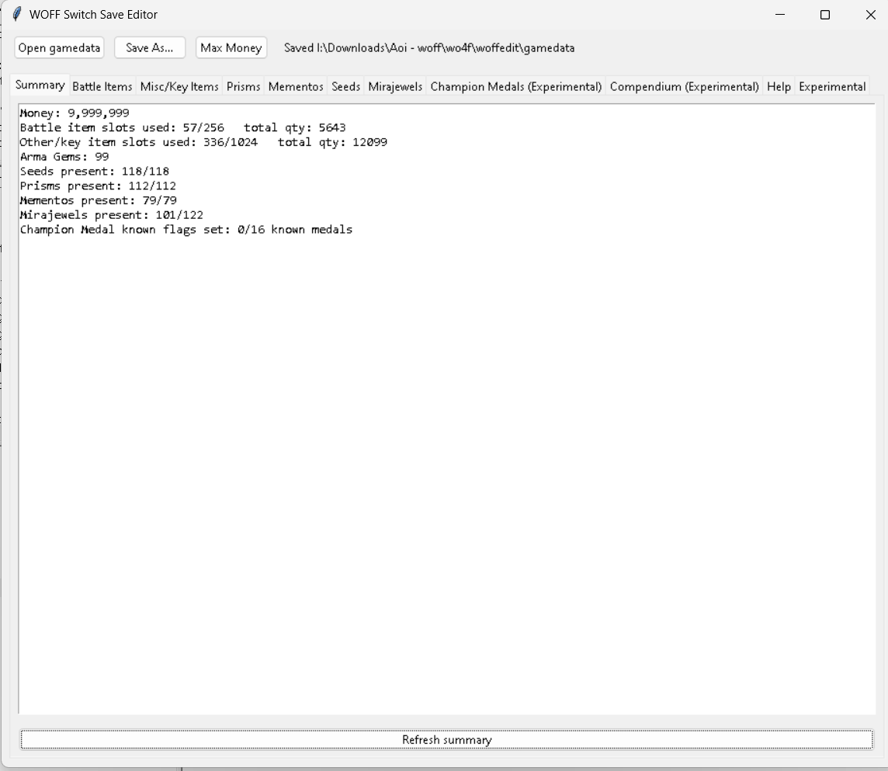

# World of Final Fantasy Maxima Switch Save Editor

A Python save editor for decrypted Nintendo Switch saves from **World of Final Fantasy Maxima**.

## Features

- Gil editing
- Battle item editing
- Key/misc item editing
- Prism editing
- Memento editing
- Seed editing
- Mirajewel editing
- Champion Medal editing *(experimental)*
- Mirage Compendium editing *(experimental)*

## Requirements

- Python 3
- Decrypted `gamedata` from JKSV or Checkpoint

## Usage

1. Back up your save with JKSV.
2. Open only the `gamedata` file.
3. Run:

```bash
woff_switch_final_update.py
```

4. Edit your save.
5. Save the modified `gamedata`.
6. Restore with JKSV.

## Warnings

- Keep backups.
- Do not edit ZIP archives directly.
- Compendium and Champion Medal editing are experimental.
- I am not responsible for any corrupt saves or data that come from using this. There is a rollback feature in the editor that should work as intended.

## Screenshot


